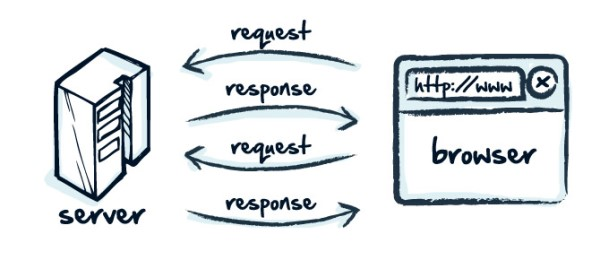

# HTTP là gì
###  HTTP viết tắt Hyper Text Transfer Protocol (Giao thức truyền tải siêu văn bản)
* HTTP là một giao thức trong bộ các giao thức TCP/IP( gồm một nhóm các giao thức nền tảng cho internet)
* HTTP hoạt động trên mô hình Client - Server dùng cho World Wide Wed - WWW

*  [Link viết MarkDown cơ bản https://guides.github.com/features/mastering-markdown/](https://guides.github.com/features/mastering-markdown/)

* Client gửi request lên Server và chờ server trả lời thông qua các giao thức và HTTP là thường xuyên nhất
* HTTP là một giao thức giúp cho việc truyền tải file tử một Wed Server đến trình duyệt Wed
### Hạn chế của HTTP
* Trong quá trình trao đổi kết nối thông tin trình duyệt mặc nhiên thừa nhận địa chỉ IP đó đến Server của chính wedsite mà bạn muốn truy nhập đến mà không có biện pháp bảo mật. Các thông tin cá nhân như tài khoản ngân hàng,... hoàn toàn có thể bị đánh cắp bởi một wedsite giả và wedsite bị nghe lén ===> Tính bảo mật không cao
* Hiện tại tất cả các trang wed ngân hàng dùng HTTPS (HyperText Transfer Protocol Secure) để nâng cao tính bảo mật
* HTTPS là sự kết hợp giữa giao thức HTTP và SSL hay TSL( Transport Layer Securerity) giúp HTTP bảo mật thông tin trên nền internet
### Phương thức dùng trong HTTP
#### HTTP Request Method 
1. GET
  * Get được sử dụng để lấy thông tin từ Server đã cung cấp bởi sử dụng một URL đã cung cấp. Các yêu cầu sử dụng **Get** chỉ nhận dữ liệu và không ảnh hưởng đến dữ liệu
2. HEAD
  * Tương tự Get nhưng nó truyền tải dòng trạng thái vào khu vực Header
3. POST 
  * Sử dụng đẻ gửi dữ liệu tới Server. VD: thông tin khách hàng, file tải lên
4. PUT
  * Thay đổi tất cả các đại diện hiện tại của nguồn mục tiêu với nội dung được tải lên
5. DELETE
 * Gỡ bỏ tất cả đại diện hiện tại của nguồn mục tiêu bởi URL
6. CONNECT
 * Thiết lập môt tunnel tới Server được xác định bởi URI đã cung cấp
7. OPTIONS
 * Miêu tả các chức năng giao tiếp cho nguồn mục tiêu
8. TRACE
 * Trình bày một vòng lặp kiểm tra thông báo song song với path tới nguồn mục tiêu
### HTTP Response
* Khi nhận và phiên dịch một HTTP Request, Server sẽ gửi tín hiệu phản hồi và một HTTP response gồm:
  * Một dòng trạng thái (Status - line)
  * Không hoặc nhiều hơn các trường Header (General| Response | Enity) được theo sau CRLF
  * Một dòng trống chỉ dòng kết thúc các trường Header
  * Một phần thân thông báo tùy ý
### HTTP CACHING là gì ?   
#### Cache là gì
* Cache tên gọi là bộ nhớ đệm là nơi lưu trữ dữ liệu nằm chờ các ứng dụng hay phần cứng xử lý. Mục đích của nó là tăng tốc độ xử lý 
  * [https://vienit.org/cache-la-gi-cac-loai-cache-va-cach-xoa-trong-win-10/](https://vienit.org/cache-la-gi-cac-loai-cache-va-cach-xoa-trong-win-10/)
### Caching  
* Caching là kỹ thuật chuyển một bản copy các tài nguyên tĩnh phía Server xuống lưu dưới Client. Về cở bản người dùng cảm nhận thấy một độ trễ rất thấp khi yêu cầu các tài nguyên tĩnh từ phía server, lưu lượng truyền đi ít hơn, số request đến Server ít hơn, do vậy Server sẽ nhàn hơn để dùng sức của mình vào những việc khác.

* VD trên
1. Client yêu cầu file index.html
2. Server làm công việc đi tìm kiếm xem file index.html ở đâu
3. Server tìm thấy và trả về cho Client
4. Client download file và hiển thị cho người dùng.
* Giả sử index.html là một file tĩnh rất ít khi thay đổi thì điều bất cập xảy ra ở đây đó là mỗi lần Client yêu cầu truy cập file này, Server đều phải lục lọi tìm kiếm rồi bắt buộc Client phải download thì mới sử dụng được. Việc làm này đang làm lãng phí thời gian của Server và thời gian của người sử dụng.
#### Tại sao cần dùng Caching 
1. Giúp cho ứng dụng Web load nhanh hơn (giảm thời gian trễ).
2. Giảm băng thông sử dụng.
3. Giảm số lần truy cập lên Server.
#### Caching hoạt động như thế nào
[https://viblo.asia/p/http-caching-6BAMYknzvnjz](https://viblo.asia/p/http-caching-6BAMYknzvnjz)
### HTTP Status Code
#### Mã trạng thái HTTP trả về mỗi khi nhận được http request   
* 1xx: Thông tin (Nghĩa là yều cầu đã được nhận và tiến trình đang xử lý) 
> VD: 100 (**Continue**): Máy chủ trả về mã này chỉ ra rằng nó nhận được phần đầu tiên của một yêu cầu và chờ đợi phần còn lại
>     101 (**Switching protocols**) Bên yêu cầu đã yêu cầu các máy chủ để chuyển đổi và máy chủ được thừa nhận rằng nó sẽ làm như vậy
 * 2xx: Thành công (Nghĩa là  nó hoạt động đã được nhân, được hiểu, và được chấp nhận một cách thành công)
 - 200(**Successful**): Các máy chủ xử lý yêu cầu thành công
 - 201(**Created**): Yêu cầu đã thành công và các máy chủ tạo một nguồn tài nguyên mới
 - 202 (**Accepted**): Máy chủ đã chấp nhận yêu cầu nhưng vẫn chưa xử lý nó
 - 203 (**Non-authoritative information**): Máy chủ xử lý yêu cầu thành công, nhưng đang quay trở lại các thông tin mà có thể là từ một nguồn khác.
 - 204 (**No content**): Các máy chủ xử lý yêu cầu thành công, nhưng không trả lại bất kỳ nội dung nào
 - 205 (**Reset content**):  Các máy chủ proccessed yêu cầu thành công, nhưng không trả lại bất kỳ nội dung. Không giống như một phản ứng 204, phản ứng này đòi hỏi người yêu cầu thiết lập lại xem tài liệu   
 - 206 (Partial content)
Các máy chủ xử lý thành công một phần của một yêu cầu

- 3xx: (Sự điều hướng lại)
Nó nghĩa là hoạt động phải được thực hiện để hoàn thành yêu cầu.

- 301 (Moved permanently)
Các trang web yêu cầu đã bị di chuyển vĩnh viễn tới URL mới

- 302 (Moved temporarily)
Trang được yêu cầu đã di chuyển tạm thời tới một URL mới

- 304 (Not modified)
Các trang yêu cầu đã không được sửa đổi kể từ khi yêu cầu cuối cùng. Khi máy chủ trả về phản hồi này, nó không trả lại các nội dung của trang.

- 4xx: (Lỗi Client)
Nó nghĩa là yêu cầu chứa cú pháp không chính xác hoặc không được thực hiện

- 400 (Bad request)
Các máy chủ không hiểu được yêu cầu.

- 401 (Not authorized)
Đề nghị yêu cầu xác thực. Máy chủ có thể trả về phản hồi này yêu cầu xác thực đăng nhập tài khoản và mật khẩu (thông thường máy chủ trả về phản hồi này nếu client gửi request một trang đăng nhập)

- 403 (Forbidden)
Máy chủ từ chối yêu cầu.(thông thường nếu đăng nhập không thành công máy chủ sẽ trả về mã lỗi này)

- 404 (Not found)
Máy chủ không thể tìm thấy trang yêu cầu. Ví dụ, máy chủ thường trả về mã này nếu có 1 yêu cầu tới một trang không tồn tại trên máy chủ.

- 405 (Method not allowed)
Phương thức được xác định trong yêu cầu là không được cho phép.

- 406 (Not acceptable)
Server chỉ có thể tạo một phản hồi mà không được chấp nhận bởi Client.

- 407 (Proxy authentication required)
Yêu cầu client phải xác thực sử dụng một proxy. Khi máy chủ trả về phản hồi này, nó cũng chỉ ra proxy mà người yêu cầu phải sử dụng.

- 408 (Request timeout)
Request tốn thời gian dài hơn thời gian Server phản hồi

- 409 (Conflict)
Các máy chủ gặp phải một cuộc xung đột thực hiện yêu cầu. Các máy chủ phải bao gồm thông tin về các cuộc xung đột trong các phản ứng. Máy chủ có thể trả về mã này để đáp ứng với yêu cầu PUT xung đột với yêu cầu trước đó, cùng với một danh sách các sự khác biệt giữa các yêu cầu.

- 410 (Gone)
Các máy chủ trả về phản hồi này khi các nguồn tài nguyên yêu cầu đã bị loại bỏ vĩnh viễn. Nó tương tự như một 404 (Không tìm thấy) mã, nhưng đôi khi được sử dụng ở vị trí của một 404 cho nguồn lực được sử dụng để tồn tại nhưng không còn làm. Nếu tài nguyên đã di chuyển vĩnh viễn, bạn nên sử dụng một 301 để xác định vị trí mới của tài nguyên.

- 411 (Length required)
Content-Length không được xác định rõ. Server sẽ không chấp nhận yêu cầu mà không có nó

- 412 (Precondition failed)
Các máy chủ không đáp ứng một trong các điều kiện tiên quyết mà người yêu cầu đưa vào yêu cầu.

- 413 (Request entity too large)
Máy chủ không thể xử lý yêu cầu bởi vì nó là quá lớn đối với các máy chủ để xử lý.

- 414 (Requested URI is too long)
URI yêu cầu (thường là một URL) là quá dài đối với máy chủ để xử lý.

- 416 (Requested range not satisfiable)
Máy chủ trả về mã trạng thái này nếu yêu cầu cho một phạm vi không có sẵn cho trang.

- 417 (Expectation failed)
Máy chủ không thể đáp ứng yêu cầu của các trường yêu cầu, tiêu đề mong đợi.

- 5xx: Lỗi Server
Nó nghĩa là Server thất bại với việc thực hiện một yêu cầu nhìn như có vẻ khả thi.

- 500 (Internal server error)
Các máy chủ gặp lỗi và không thể thực hiện yêu cầu.

- 501 (Not implemented)
Các máy chủ không có các chức năng để thực hiện yêu cầu. Ví dụ, máy chủ có thể trả về mã này khi nó không nhận ra phương thức yêu cầu.

- 502 (Bad gateway)
Các máy chủ đã hoạt động như một gateway hoặc proxy và nhận được một phản ứng không hợp lệ từ máy chủ ngược.

- 503 (Service unavailable)
Máy chủ hiện không có sẵn (vì nó bị quá tải hoặc xuống để bảo trì). Nói chung, đây là một trạng thái tạm thời.

- 504 (Gateway timeout)
Các máy chủ đã hoạt động như một gateway hoặc proxy và đã không nhận được yêu cầu kịp thời từ máy chủ ngược.

- 505 (HTTP version not supported
Các máy chủ không hỗ trợ phiên bản giao thức HTTP được sử dụng trong yêu cầu.

Sau đây là danh sách tất cả các mã trạng thái HTTP được liệt kê theo tài liệu giao thức HTTP của trang w3c 
   * [Chi tiết http://www.restapitutorial.com/httpstatuscodes.html](http://www.restapitutorial.com/httpstatuscodes.html)
   * [https://httpstatuses.com/](https://httpstatuses.com/)

